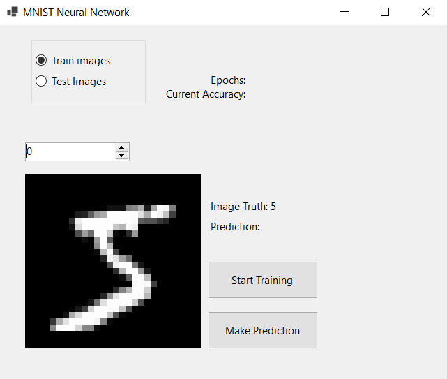
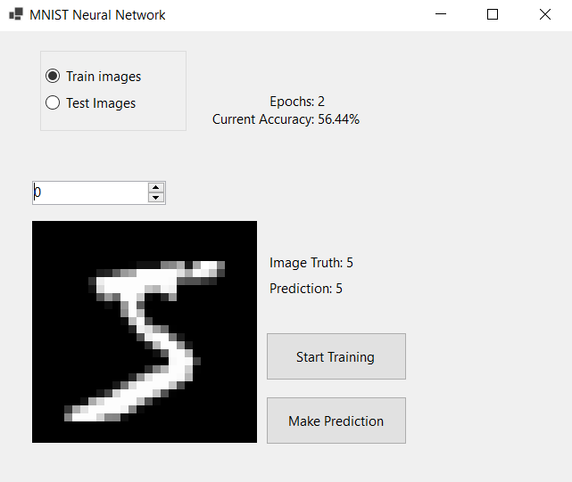

# MNIST Neural Network from Scratch

This is a Neural Network made from scratch written in C# using the .NET framework.

It classifies the MNIST Handwritten Digit dataset.

                
(source: [MNIST database](https://en.wikipedia.org/wiki/MNIST_database)

# How it works
Bellow is the application for the program.
Before the Neural Network can start classifying images, it must be trained at least once.
Pressing the "Start Training" button will begin one training cycle. The training process is CPU intensive so it will take a while to complete.

After training the Neural Network, it will be able to start making predicitions on what the current image is.

